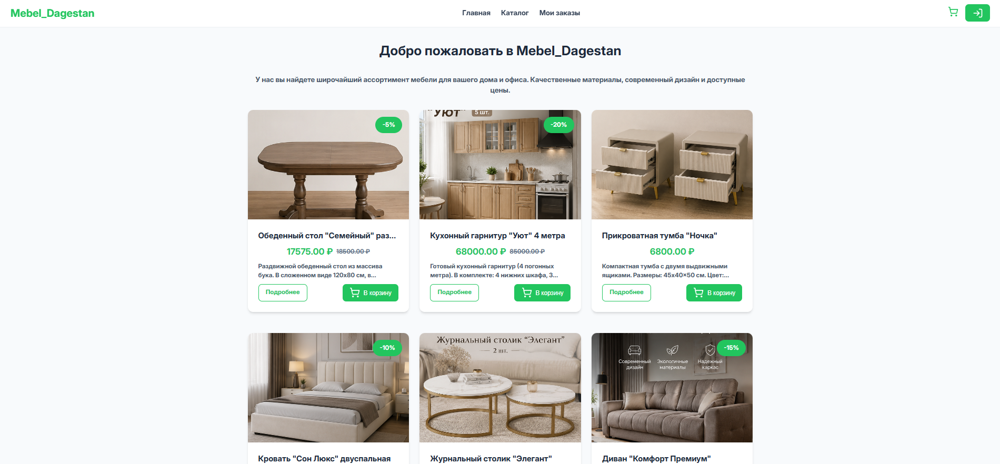
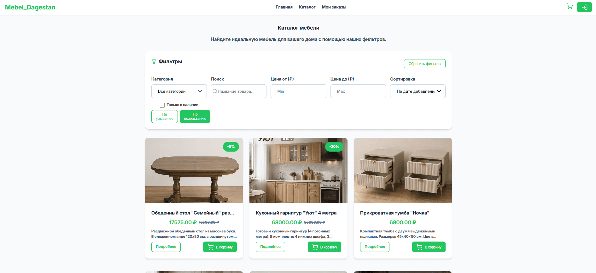
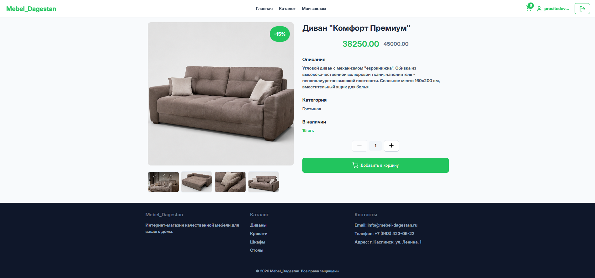
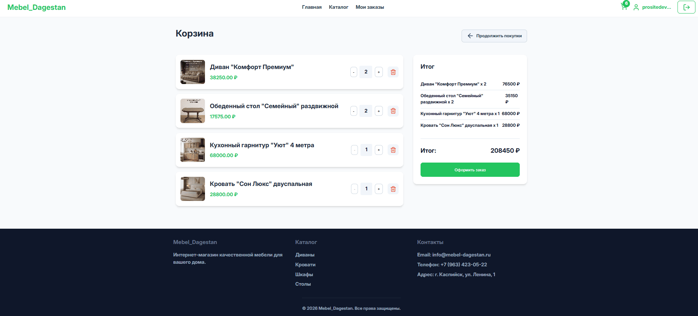
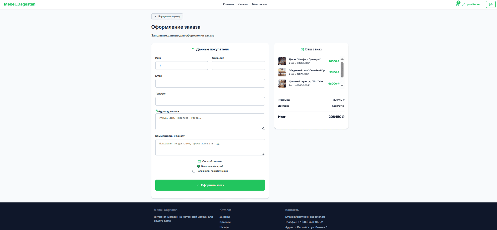
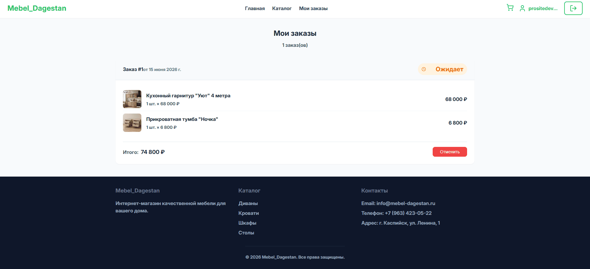
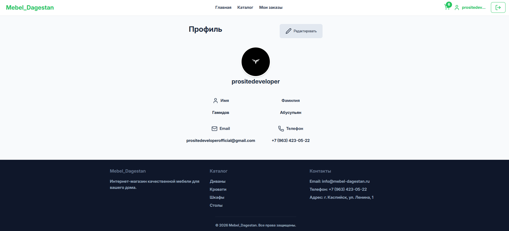
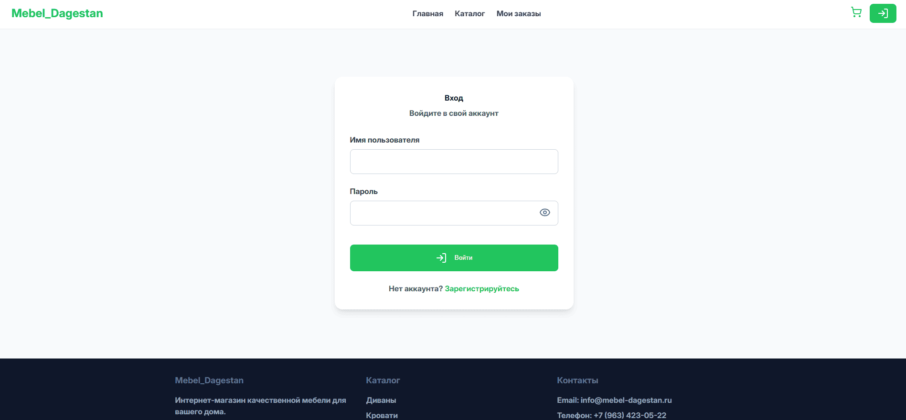
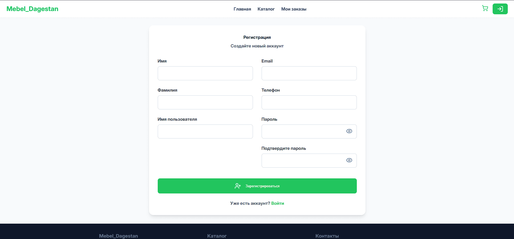

# 🛋️ Mebel_Dagestan - Интернет-магазин мебели

## 📌 Описание
Интернет-магазин мебели с возможностью просмотра каталога, добавления товаров в корзину, оформления заказов и управления профилем.

## 📋 Содержание

- [Технологии](#технологии)
- [Клонирование репозитория](#-клонирование-репозитория)
- [Запуск проекта](#-запуск-проекта)
  - [Backend (Django + DRF)](#-backend-django--drf)
  - [Frontend (React + Vite)](#-frontend-react--vite)
- [API Эндпоинты](#-api-эндпоинты)
  - [Аутентификация](#-аутентификация-apiauth)
  - [Товары](#-товары-apiproducts)
  - [Категории](#-категории-apiproducts)
  - [Заказы](#-заказы-apiorders)
- [Права доступа](#-права-доступа)
- [Структура проекта](#-структура-проекта)
- [Скриншоты программы](#-скриншоты-программы)
- [Автор](#-автор)

## Технологии

| Часть проекта | Технологии |
|---------------|------------|
| Backend | Django, Django REST Framework, JWT (SimpleJWT), SQLite3 (для разработки), Django Filter, CORS |
| Frontend | React 18, Vite, SASS (SCSS), Axios, React Router v6, Context API, Lucide React (иконки) |
| Стили | SASS (переменные, миксины, вложенные селекторы) |


## 🚀 Запуск проекта

## 📦 Клонирование репозитория

```bash
git clone https://github.com/prositedeveloper/Mebel_Dagestan.git
cd Mebel_Dagestan
```

### 📂 Backend (Django + DRF)
```bash
cd backend
python -m venv venv
source venv/bin/activate  # Linux/Mac
venv\Scripts\activate     # Windows
pip install -r requirements.txt
python manage.py migrate
python manage.py createsuperuser  # Создать админа (для доступа к админке)
python manage.py runserver
```

### 📂 Frontend (React + Vite)
```bash
cd frontend
npm install                        # Установка зависимостей
npm run dev                        # Запуск в режиме разработки
```

## 🌐 API Эндпоинты
#### Базовый URL: 
```bash 
http://localhost:8000/api/
```
##### 📌 Аутентификация (/api/auth/)
| Эндпункт | Метод | Описание | Доступ | Права |
|---------------|------------|---------------|------------| ------------|
| /auth/register/ | POST | Регистрация нового пользователя | Все | AllowAny |
| /auth/login/ | POST | Авторизация (получение JWT-токенов: access и refresh) | Все | AllowAny |
| /auth/token/refresh/ | POST | Обновление access-токена по refresh-токену | Авторизованные | IsAuthenticated |
| /auth/profile/ | GET | Получение данных профиля пользователя | Авторизованные | IsAuthenticated |
| /auth/profile/ | PATCH | Обновление данных профиля (имя, фамилия, email, телефон, аватар) | Авторизованные | IsAuthenticated |
| /auth/users/ | GET | Список всех пользователей (только для админа) | Админы | IsAdminUser |


##### 📌 Товары (/api/products/)
| Эндпункт | Метод | Описание | Доступ | Права |
|---------------|------------|---------------|------------| ------------|
| /products/ | GET | Список всех товаров (с пагинацией, фильтрацией и сортировкой) | Все | AllowAny |
| /products/ | POST | Создание нового товара | Админы | IsAdminUser |
| /products/{id}/ | GET | Получение информации о конкретном товаре | Все | AllowAny |
| /products/{id}/ | PUT/PATCH | Обновление товара | Админы | IsAdminUser |
| /products/{id}/ | DELETE | Удаление товара | Админы | IsAdminUser |
| /products/upload_image/ | POST | Загрузка изображения для товара (с указанием product_id) | Админы | IsAdminUser |

### Параметры фильтрации для `/products/`

| Параметр | Тип | Описание | Пример |
|----------|-----|----------|--------|
| `page` | int | Номер страницы (пагинация) | `?page=2` |
| `page_size` | int | Количество товаров на странице (по умолчанию: 12) | `?page_size=24` |
| `category_id` | int | Фильтрация по категории | `?category_id=1` |
| `search` | string | Поиск по названию или описанию | `?search=диван` |
| `min_price` | decimal | Минимальная цена | `?min_price=10000` |
| `max_price` | decimal | Максимальная цена | `?max_price=50000` |
| `in_stock` | bool | Только товары в наличии | `?in_stock=true` |
| `ordering` | string | Сортировка (price, -price, created_at, -discount) | `?ordering=-price` |

#### Примеры запросов с фильтрацией:

```bash
# Товары категории 1, отсортированные по убыванию цены
GET /api/products/products/?category_id=1&ordering=-price

# Поиск диванов в диапазоне цен от 10000 до 50000
GET /api/products/products/?search=диван&min_price=10000&max_price=50000

# Вторая страница, 24 товара на странице, только в наличии
GET /api/products/products/?page=2&page_size=24&in_stock=true
```


##### 📌 Категории (/api/products/)
| Эндпункт | Метод | Описание | Доступ | Права |
|---------------|------------|---------------|------------| ------------|
| /categories/ | GET | Список всех категорий | Все | AllowAny |
| /categories/ | POST | Создание новой категории | Админы | IsAdminUser |
| /categories/{id}/ | GET | Получение информации о категории | Все | AllowAny |
| /categories/{id}/ | PUT/PATCH | Обновление категории | Админы | IsAdminUser |
| /categories/{id}/ | DELETE | Удаление категории | Админы | IsAdminUser |

##### 📌 Заказы (/api/orders/)
| Эндпункт | Метод | Описание | Доступ | Права |
|---------------|------------|---------------|------------| ------------|
| /orders/ | GET | Список заказов пользователя (или всех заказов для админа) | Авторизованные | IsAuthenticated (или IsAdminUser) |
| /orders/ | POST | Создание нового заказа | Авторизованные | IsAuthenticated |
| /orders/{id}/ | GET | Получение информации о заказе | Авторизованные (или админ) | IsAuthenticated (или IsAdminUser) |
| /orders/{id}/cancel/ | POST | Отмена заказа (только для владельца или админа) | Авторизованные | IsAuthenticated |


## 🔐 Права доступа
| Роль | Описание | Что может делать |
|---------------|------------|------------|
| Гость | Неавторизованный пользователь | Просматривать товары, категории, информацию о товарах. Не может добавлять в корзину или оформлять заказы. |
| Пользователь | Авторизованный пользователь (имеет JWT-токен) | Просматривать товары, добавлять в корзину, оформлять заказы, управлять своим профилем, просматривать свои заказы. |
| Администратор | Пользователь с правами is_staff=True | Управлять товарами (CRUD), категориями, заказами (просмотр всех заказов, изменение статуса), пользователями (просмотр списка, изменение прав). Полный доступ ко всем эндпоинтам. |

## 📜 Требования к окружению

| Компонент | Версия | Описание |
|---------------|------------|------------|
| Python | 3.10+ | Для работы Django |
| Node.js | 18+| Для работы React и Vite |
| SQLite3 | Встроенный | База данных для разработки |
| Django | 6.0 | Фреймворк для бэкенда |
| Django REST Framework | 3.14+ | Для создания API |
| React | 18+ | Фреймворк для фронтенда |
| Vite | 4+ | Сборщик для React |


## 📁 Структура проекта

```
Mebel_Dagestan/
├── backend/                 # Django + DRF бэкенд
│   ├── config/              # Настройки Django
│   ├── products/            # Приложение товаров
│   ├── users/               # Приложение пользователей (JWT)
│   ├── orders/              # Приложение заказов
│   └── manage.py            # Управляющий скрипт Django
├── frontend/                # React + Vite + SASS фронтенд
│   ├── src/
│   │   ├── components/      # Переиспользуемые компоненты (Header, ProductCard, etc.)
│   │   ├── pages/           # Страницы приложения (Home, Catalog, Cart, etc.)
│   │   ├── hooks/           # Кастомные хуки
│   │   ├── styles/          # Sass стили
│   │   ├── services/        # Axios и API запросы
│   │   ├── context/         # Context API (AuthContext, CartContext)
│   │   ├── App.jsx          # Главный компонент приложения
│   │   └── main.jsx         # Точка входа
│   └── index.html           # HTML шаблон
├── screenshots/             # Скриншоты программы
│   ├── home.png
│   ├── catalog.png
│   ├── product.png
│   ├── cart.png
│   ├── checkout.png
│   ├── profile.png
│   ├── my-orders.png
│   ├── login.png
│   └── register.png
└── README.md                # Документация проекта
```


## 📸 Скриншоты программы
### 🖼️ Главная страница


### 🖼️ Страница каталога


### 🖼️ Страница товара


### 🖼️ Корзина


### 🖼️ Оформление заказа


### 🖼️ Мои заказы


### 🖼️ Профиль пользователя


### 🖼️ Вход


### 🖼️ Регистрация



## 👨‍💻 Автор

<div align="center">
  <h3>🔥 Гамидов Абусупьян Альбертович</h3>
  
  [](mailto:prositedeveloperofficial@gmail.com)
  [](https://t.me/prositedeveloper)
  [](https://github.com/prositedeveloper)
  
  
  
</div>